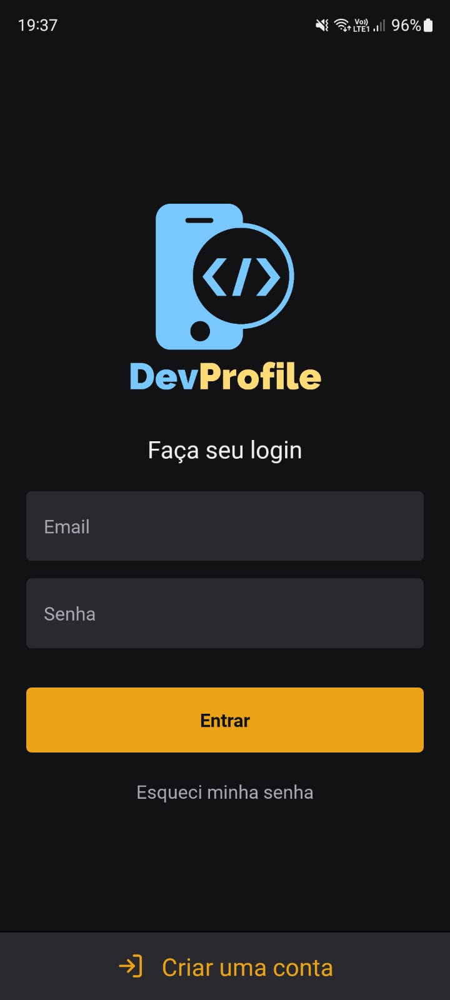
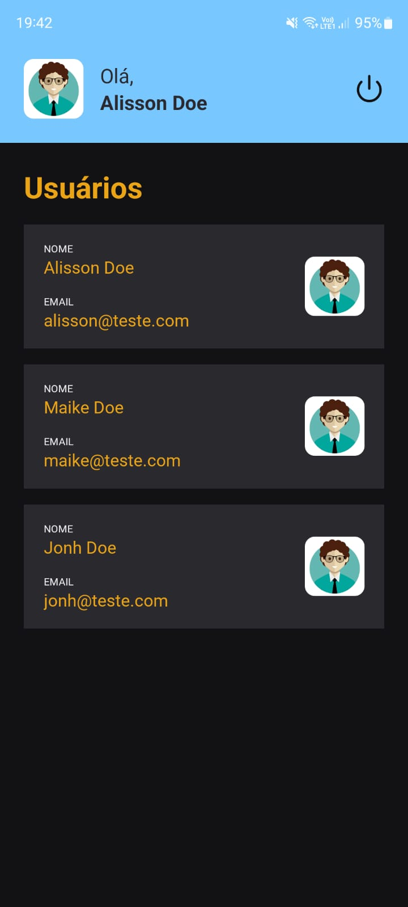

## 🎲 Running application server 

```sh
npx expo start
npx expo android
npx expo ios
npx expo web
```

## ✅ Installation 

```sh
npx create-expo-app --template
npm i -D eslint @rocketseat/eslint-config
npm i axios
npm i react-hook-form
npm i styled-components
npm i @types/styled-components --save-dev
npm i @types/styled-components-react-native --save-dev
npm i yup
npm i @react-native-async-storage/async-storage
npm i react-native-gesture-handler
npm install @react-navigation/native
npx expo install react-native-screens react-native-safe-area-context
npm install @react-navigation/native-stack
```

## 📝 Documents used in the installation of the project

- [Expo: Docs](https://docs.expo.dev/)
- [Rocketseat: ESLint config](https://github.com/Rocketseat/eslint-config-rocketseat)
- [Axios: Docs](https://axios-http.com/ptbr/docs/intro)
- [React Hook Forms: Docs](https://react-hook-form.com/get-started)
- [Styled Components: Docs](https://styled-components.com/docs/basics#installation)
- [Yup: Docs](https://github.com/jquense/yup)
- [Async Storage: Docs](https://react-native-async-storage.github.io/async-storage/docs/install/)
- [React Navigation: Docs](https://reactnavigation.org/docs/getting-started)

## ✅ Download API Back-End
<h2 align="center">
    <a href="https://github.com/aluiziodeveloper/api-node-devprofile">Api Node JS 🌐</a>
</h2>


## 🎁 Project Images 
<p align="center">
  
  
  
  
  
</p>

